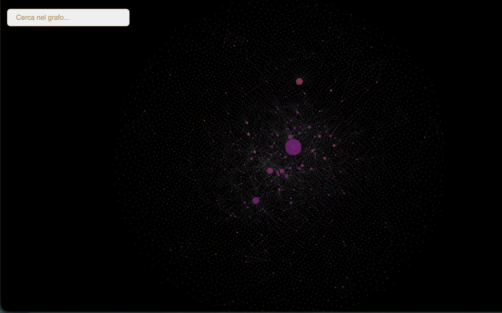
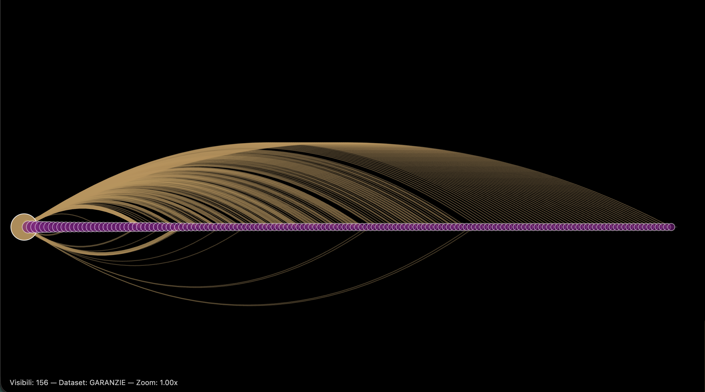

# Data Model

This document defines the structural data model underlying the Mediobanca Credit Network Visualization.

---

## Overview

The network documented here should be understood as a specialization of a broader relational graph derived from the Mediobanca historical archive and published in the companion repository:

https://github.com/mediobancaspa/Mediobanca-Credit-Network

Within that broader model, connections between entities are represented as part of a general relational structure. The present graph is conceived as an extension and analytical specification of that network, designed to make explicit the nature of the links connecting entities.

More specifically, its purpose is to reconstruct and visualize two classes of relationships that are not explicitly distinguished in the general graph:

- shareholder relationships (*soci*)
- guarantee relationships (*garanzie*)

The resulting network is therefore not an independent graph, but a typed and specialized projection of the broader Mediobanca Credit Network. Its analytical value lies in qualifying relational ties that, in the general graph, remain structurally visible but semantically undifferentiated.

In this sense, the model serves both as an interpretative refinement of the original network and as a dedicated environment for exploring the role of shareholders and guarantors in the relational structure emerging from archival credit records.

---

## Relationship to the general network



*Figure 1. General relational network derived from the Mediobanca historical archive.*



*Figure 2. Specialized network focused on shareholder (*soci*) and guarantee (*garanzie*) relationships.*

---

## Nodes

Each node represents a unique economic actor involved in the reconstructed credit network.

Nodes are not introduced independently from the relationships, but are derived from the edge datasets: every entity appearing as `source` or `target` in the reconstructed shareholder (*soci*) and guarantee (*garanzie*) relations is indexed as a node. In the processed structure, each node is associated with a stable textual form and, where available, with its archival identifier (`codice` / IdxDams). :contentReference[oaicite:2]{index=2}

### Identity and normalization

Nodes are identified by their normalized name, corresponding to the *forma autorizzata* used during data processing and preserved in the visualization layer.

This normalization is essential for three reasons:

- it prevents the same entity from appearing multiple times under slightly different textual forms  
- it aligns the specialized graph with the broader Mediobanca Credit Network  
- it ensures consistency between reconstructed edge datasets and node lookup functions in the interface  

As a result, each node corresponds to a single stabilized representation of an actor within the network. :contentReference[oaicite:3]{index=3}

### Node weight

Each node carries an importance value computed directly from the reconstructed edges.

In the current implementation, node importance is calculated as the cumulative sum of the weights of all incident edges. This means that, whenever an entity appears as either `source` or `target`, the weight of that relationship contributes to its score. The node therefore acquires importance through the total intensity of its participation in the network, rather than through a simple binary count of links. 

### Node size

The node importance value is used in the visualization layer to determine node size.

During rendering, node radius is scaled between a minimum and a maximum value on the basis of the node's relative score within the visible set. Larger nodes therefore correspond to entities with higher accumulated relational importance, while smaller nodes indicate actors involved in fewer or weaker reconstructed relations. 

### Initial visibility and node retrieval

At dataset initialization, the interface does not render the full node set immediately. Instead, it computes the ranking of nodes by importance and displays only the top 30 entities for the active dataset. This choice reduces visual overload and provides a readable first view centred on the most structurally relevant actors. 

The visibility model is then expanded through interaction. When a node is searched or selected, the system:

- adds the selected node to the visible set  
- retrieves all incident edges connected to that node  
- adds the corresponding neighboring nodes linked through those edges  

This mechanism allows nodes outside the initial top 30 to appear dynamically when they become analytically relevant, without requiring the full graph to be displayed from the outset. 

---

## Edges

Edges represent directed relationships between entities.

### Directionality

- client → shareholder (socio)  
- client → guarantor (garante)  

---

## Edge attributes

```json
{
  "source": "Entity A",
  "target": "Entity B",
  "weight": 3,
  "documents": [...],
  "idxdams": [...]
}
```

### Description

- **source / target**: entities involved in the relationship  
- **weight**: number of occurrences across archival records  
- **documents**: supporting archival references  
- **idxdams**: unique identifiers linked to archival records  

---

## Aggregation

Relationships are aggregated:

- repeated edges are merged  
- weights are summed  
- documents are combined  
- identifiers are deduplicated  

---

## Dataset structure

The model is implemented through separate datasets:

- soci (shareholder relationships)  
- garanzie (guarantee relationships)  

These share the same node space but represent different relational semantics.
